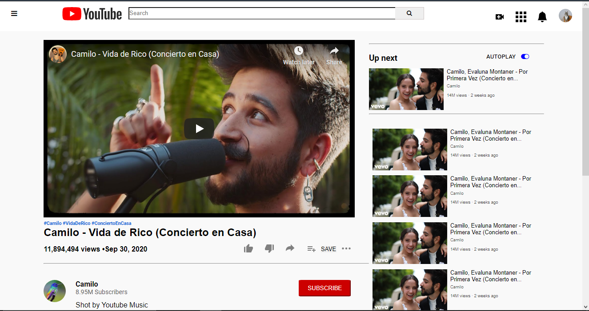

# Project Name

> One paragraph statement about the project.

Additional description about the project and its features.

## Built With

- Major languages
- Frameworks
- Technologies used

## Live Demo

[Live Demo Link](https://livedemo.com)

## Getting Started

**This is an example of how you may give instructions on setting up your project locally.**
**Modify this file to match your project, remove sections that don't apply. For example: delete the testing section if the currect project doesn't require testing.**

To get a local copy up and running follow these simple example steps.

### Prerequisites

### Setup

### Install

### Usage

### Run tests

### Deployment

## Authors

👤 **Author1**

- GitHub: [@leolpaz](https://github.com/leolpaz)
- Twitter: [@leonardolpaz95](https://twitter.com/leonardolpaz95)
- LinkedIn: [Leonardo Paz](https://www.linkedin.com/in/leonardo-paz-a925611b5/)

👤 **Author2**

- GitHub: [@gasb150](https://github.com/gasb150)
- Twitter: [@7aves](https://twitter.com/7aves)
- LinkedIn: [Gutavo Sanmartin](https://www.linkedin.com/in/gustavo-sanmartin-b3b68261/)

## 🤝 Contributing

Contributions, issues, and feature requests are welcome!

Feel free to check the [issues page](issues/).

## Show your support

Give a ⭐️ if you like this project!

## Acknowledgments

- Hat tip to anyone whose code was used
- Inspiration
- etc

## 📝 License

This project is [MIT](lic.url) licensed.
